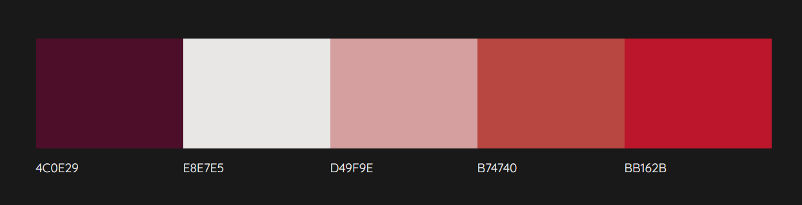
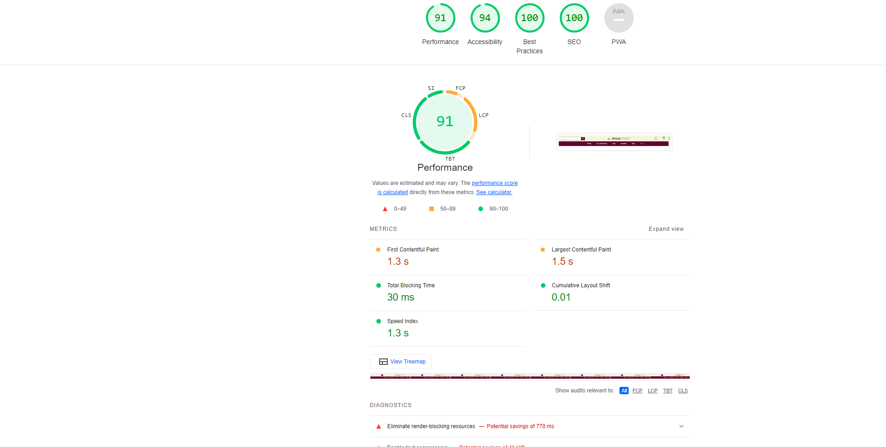

# Project Portfolio 5 - E-commerce Applications
## Welcome to Style Street - Your Premier E-commerce Destination

Discover a seamless shopping experience with Style Street, the cutting-edge e-commerce platform designed to elevate your retail experience. Our app combines state-of-the-art technology with intuitive design, ensuring a smooth and enjoyable journey from browsing to checkout.

## Project Goal

Our goal is to develop a user-friendly E-commerce platform using Django, providing customers with seamless browsing, secure transactions, and efficient order management. Through intuitive design and robust features, we aim to enhance the online shopping experience, driving customer satisfaction and facilitating business growth.


**[View the live project here.](https://stylestreet-2f7b5324506f.herokuapp.com/)**

1. [Design & Planning](#design-&-planning)
    * [User Stories](#user-stories)
    * [Wireframes](#wireframes)
    * [Agile Methodology](#agile-methodology)
    * [Typography](#typography)
    * [Colour Scheme](#colour-scheme)
    * [Database Diagram](#database-diagram)
    
2. [Features](#features)
    * [Navigation](#Navigation-bar)
    * [Footer](#footer)
    * [Home page](#home-page)
    * [add your pages](#)
    * [Login page](#profile-page)
    * [Sign up page](#signup-page)

3. [Technologies Used](#technologies-used)
4. [Libraries](#libraries-used)
5. [Testing](#testing)
6. [Bugs](#bugs)
7. [Deployment](#deployment)
8. [Credits](#credits)
9. [Acknowledgment](#acknowledgment)

## Design & Planning:

### User Stories

# First-Time Visitor
- Learn About the Site: As a first-time visitor, I want to understand the site’s purpose to decide if it meets my needs.
- Browse Products: As a first-time visitor, I want to browse products to see what is available.
- Register for an Account: As a first-time visitor, I want to create an account to start shopping.
- Search for Products: As a first-time visitor, I want to search for specific products to find what I need quickly.
- View Product Details: As a first-time visitor, I want to view detailed product information to make informed purchase decisions.### Wireframes

# Returning Visitor
- Login to Account: As a returning visitor, I want to log in to my account to access my saved information and preferences.
- View Order History: As a returning visitor, I want to view my past orders to reorder items or check past purchases.
- Add to Cart: As a returning visitor, I want to add items to my shopping cart to purchase them.
- Save Payment Methods: As a returning visitor, I want to save and manage my payment methods for quicker checkouts in the future.
- Receive Personalized Recommendations: As a returning visitor, I want to receive product recommendations based on my previous purchases and preferences.
- Leave Reviews: As a returning visitor, I want to leave reviews and rate products I have purchased to share my experience with others.
- Subscribe to Newsletter: As a returning visitor, I want to subscribe to the newsletter to receive updates and promotions.
- Contact Customer Support: As a returning visitor, I want to contact customer support easily to get help with any issues.
- View New Arrivals: As a returning visitor, I want to view new product arrivals to stay updated with the latest items.

# Site Owner
- Manage Products: As a site owner, I want to add, update, or remove products to keep the inventory current.
- View Sales Reports: As a site owner, I want to view sales reports to understand the business performance.
- Manage Users: As a site owner, I want to manage user accounts to ensure a smooth user experience.
- Update Site Content: As a site owner, I want to update site content to keep information accurate and relevant.
- Handle Customer Inquiries: As a site owner, I want to handle customer inquiries to maintain customer satisfaction.
- Process Orders: As a site owner, I want to process and fulfill orders efficiently to ensure timely delivery.
- Manage Discounts and Promotions: As a site owner, I want to create and manage discounts and promotions to attract and retain customers.
- Monitor Site Performance: As a site owner, I want to monitor the site’s performance to ensure it runs smoothly and quickly.
- Manage Inventory Levels: As a site owner, I want to monitor and manage inventory levels to prevent stockouts and overstocking.
- Optimize SEO: As a site owner, I want to optimize the site for search engines to increase visibility and attract more visitors.
- Monitor Competitor Activities: As a site owner, I want to monitor competitor activities and trends to stay competitive in the market.
- Manage Refunds and Returns: As a site owner, I want to handle refunds and returns efficiently to maintain customer trust.

Attach wireframes in this section
### Agile Methodology
Explain agile approach to your project (itterations, user stories, tasks,acceptance criteria, labels, story points...) and insert screenshoots of your Kanban board 
### Typography
Explain font you've used for your project
### Colour Scheme



Image of the database diagram for your project, you can name your database models as well and how they are connected

## Features:
Explain your features on the website,(navigation, pages, links, forms, input fields, CRUD....)

## Future Features 
- Personalized Recommendations: Implement a recommendation engine that analyzes user behavior and preferences to suggest relevant products, increasing engagement and sales.

- Social Media Integration: Allow users to share their favorite products on social media platforms and integrate social login options to streamline the registration process.

- Multi-Language Support: Expand your target audience by adding support for multiple languages, enabling users from different regions to access and navigate the site in their preferred language.

- Customer Reviews and Ratings: Enable customers to leave reviews and ratings for products, fostering trust and credibility among potential buyers and helping them make informed purchasing decisions.

- Subscription Services: Introduce subscription-based services or product bundles, providing customers with recurring deliveries and discounts, promoting customer loyalty and repeat purchases.

## Technologies Used
List of technologies used for your project
## Testing
Important part of your README!!!
### Google's Lighthouse Performance

### Browser Compatibility
Check compatability with different browsers (Firefox, Edge, Chrome)
### Responsiveness
Screenshots of the responsivness, pick few devices
### Code Validation
Validate your code HTML, CSS, JS & Python (Validate all your templates, static files, views, forms, models, urls), display screenshots
### Manual Testing user stories
Test all your user stories, you an create table 
User Story |  Test | Pass
--- | --- | :---:
paste here you user story | what is visible to the user and what action they should perform | &check;
- attach screenshot
### Manual Testing features
Test all your features, you can use the same approach 
| Status | feature
|:-------:|:--------|
| &check; | description
- attach screenshot
### Automated testing
If you created automated tests, insert screenshoots of your coverage and number of tests
## Bugs
List of bugs and how did you fix them, you can create simple table
| Bug | Fix
|:-------:|:--------|
|   |    |

### Frameworks & Tools

- [Django](https://www.djangoproject.com/) used as main python framework
- [Stripe Payments](https://stripe.com/) Payments infrastructure for the Internet
- [Bootstrap](https://blog.getbootstrap.com/) used for page layout and spacing
- [PostgreSQL](https://www.postgresql.org) used for database management
- [ElephantSQL](https://www.elephantsql.com/) used for production database
- [Heroku](https://dashboard.heroku.com/apps) used to deploy application
- [AWS](https://aws.amazon.com/s3/) used for online static file storage
- [Gitpod](https://www.gitpod.io/) used to create and host the website
- [Github](https://github.com/) used to deploy the website 
- [Balsamiq](https://balsamiq.com/) used to create page wireframes
- [Stackoverflow](https://stackoverflow.com/) used to troubleshoot code issues
- [CI Python Linter](https://pep8ci.herokuapp.com/) used as Python code validator
- [Chrome Dev Tools](https://developer.chrome.com/docs/devtools/)
- [Grammarly](https://www.grammarly.com/) used to check typography
- [Am I Responsive](https://amiresponsive.co.uk/) mockup image of the home page on various devices 
- [ChatGPT](chat.openai.com) - Helpful Tool

### Imported Libraries and Packages

- [gunicorn]() - Python WSGI HTTP Server for UNIX
- [psycopg2]() - PostgreSQL database adapter for Python
- [dj-database-url]() - Django utility to utilise the DATABASE_URL environment variable to configure the Django application. Used with PostgreSQL
- [Django]() - Python package for the Django framework
- [django-allauth]() - Django user authentication, registration and account management
- [django-crispy-forms]() - Django package that provides tags and filters to control the rendering behaviour of Django forms
- [django-countries] - A Django application that provides country choices for use with forms
- [django-storages] - provides a variety of storage backends in a single library
- [sqlparse] - is a non-validating SQL parser for Python. It provides support for parsing, splitting and formatting SQL statements
- [stripe] - Stripe Payments webhook
- [boto3] -  to create, configure, and manage AWS services
- [s3transfer] - a Python library for managing Amazon S3 transfers
- [botocore] - A low-level interface to a growing number of Amazon Web Services
- [jmespath] - allows you to declaratively specify how to extract elements from a JSON document.
- [oauthlib] - is a framework which implements the logic of OAuth1 or OAuth2 without assuming a specific HTTP request object or web framework
- [asgiref] -  Provides an optional template to start ASGI channel layers from with the two exceptions you need provided and all APIs
- [Pillow] -  adds image processing capabilities to your Python interpreter
- [PyJWT] - A library which allows you to encode and decode JSON Web Tokens 
- [pytz] - This library allows accurate and cross platform timezone calculations using Python

## Deployment
The live deployed application can be found deployed on [Heroku](https://stylestreet-2f7b5324506f.herokuapp.com/).

#### Creating Repository on GitHub
- First make sure you are signed into [Github](https://github.com/) and go to the code institutes template, which can be found [here](https://github.com/Code-Institute-Org/gitpod-full-template).
- Then click on **use this template** and select **Create a new repository** from the drop-down. Enter the name for the repository and click **Create repository from template**.
- Once the repository was created, I clicked the green **gitpod** button to create a workspace in gitpod so that I could write the code for the site.

#### Creating an app on Heroku
- After creating the repository on GitHub, head over to [heroku](https://www.heroku.com/) and sign in.
- On the home page, click **New** and **Create new app** from the drop down.
- Give the app a name(this must be unique) and select a **region** I chose **Europe** as I am in Europe, Then click **Create app**.

#### Create a database On ElephantSQL
- Log into the [ElephantSQL](https://www.elephantsql.com/) website and click **Create new Instance**
- Enter a **Name** and keep the plan as **Tiny Turtle Free**, then **tags** field can be left blank, Select a region closest to you, I selected **EU-West-1(Ireland)** as I'm in Ireland. Then click **Review** and afterward click **create an instance**.
- On The Dashboard click on your database instance name.
- You will see the details for your database instance, in the URL section click on the copy icon to copy the database URL.
- Head over to gitpod and create a **Database URL** environment variable in your env.py file and set it equal to the copied URL.

#### Deploying to Heroku.
- Head back over to [heroku](https://www.heroku.com/) and click on your **app** and then go to the **Settings tab**
- On the **settings page** scroll down to the **config vars** section and enter the **DATABASE_URL** which you will set equal to the elephantSQL URL, create **Secret key** this can be anything,
**CLOUDINARY_URL** this will be set to your cloudinary url and finally **Port** which will be set to 8000.
- Then scroll to the top and go to the **deploy tab** and go down to the **Deployment method** section and select **Github** and then sign into your account.
- Below that in the **search for a repository to connect to** search box enter the name of your repository that you created on **GitHub** and click **connect**
- Once it has been connected scroll down to the **Manual Deploy** and click **Deploy branch** when it has deployed you will see a **view app** button below and this will bring you to your newly deployed app.
- Please note that when deploying manually you will have to deploy after each change you make to your repository.

### Local Deployment

This project can be cloned or forked in order to make a local copy on your own system.

For either method, you will need to install any applicable packages found within the *requirements.txt* file.
- `pip3 install -r requirements.txt`.

You will need to create a new file called `env.py` at the root-level,
and include the same environment variables listed above from the Heroku deployment steps.

Sample `env.py` file:

```python
import os

os.environ.setdefault("AWS_ACCESS_KEY_ID", `HEROKU CONFIG VARS`)
os.environ.setdefault("AWS_SECRET_ACCESS_KEY", `HEROKU CONFIG VARS`)
os.environ.setdefault("DATABASE_URL", `HEROKU CONFIG VARS`)
os.environ.setdefault("EMAIL_HOST_PASS", `HEROKU CONFIG VARS`)
os.environ.setdefault("EMAIL_HOST_USER", `HEROKU CONFIG VARS`)
os.environ.setdefault("SECRET_KEY", `HEROKU CONFIG VARS`)
os.environ.setdefault("STRIPE_PUBLIC_KEY", `HEROKU CONFIG VARS`)
os.environ.setdefault("STRIPE_SECRET_KEY", `HEROKU CONFIG VARS`)
os.environ.setdefault("STRIPE_WH_SECRET", `HEROKU CONFIG VARS`)

# local environment only (do not include these in production/deployment!)
os.environ.setdefault("DEBUG", "True")
```

Once the project is cloned or forked, in order to run it locally, you'll need to follow these steps:
- Start the Django app: `python3 manage.py runserver`
- Stop the app once it's loaded: `CTRL+C` or `⌘+C` (Mac)
- Make any necessary migrations: `python3 manage.py makemigrations`
- Migrate the data to the database: `python3 manage.py migrate`
- Create a superuser: `python3 manage.py createsuperuser`
- Load fixtures (if applicable): `python3 manage.py loaddata file-name.json` (repeat for each file)
- Everything should be ready now, so run the Django app again: `python3 manage.py runserver`

[Back to top &uarr;](#contents)

***
## Credits

- [Stack Overflow](https://stackoverflow.com/) is probably a developer's best resource, this provided me with many answers to my questions.

- [W3schools](https://www.w3schools.com/) this was great for looking up forgotten **CSS** syntax and how to use it.

- [CodeInstitute](https://learn.codeinstitute.net/) for their walkthrough project, which guided me with website build especially for stripe payment, custom model.

- [youtube](https://www.youtube.com/channel/UCCezIgC97PvUuR4_gbFUs5g) Corey Schafer 
 videos from **codemy**,  **djangolessons**

- [Allauth](https://django-allauth.readthedocs.io/en/latest/) for their documentation which was helpfull in creating user authentication.

- [Djangoforbeginners](https://djangoforbeginners.com/) for providing useful information abut basic concepts and setup for django.

- [DjangoDocumentation](https://docs.djangoproject.com/en/5.0/) Django Documentation used for this project.

- [Bootstrap](https://getbootstrap.com/) Used Bootstrap.

#### Cloning

You can clone the repository by following these steps:

1. Go to the [GitHub repository](https://stylestreet-2f7b5324506f.herokuapp.com/) 
2. Locate the Code button above the list of files and click it 
3. Select if you prefer to clone using HTTPS, SSH, or GitHub CLI and click the copy button to copy the URL to your clipboard
4. Open Git Bash or Terminal
5. Change the current working directory to the one where you want the cloned directory
6. In your IDE Terminal, type the following command to clone my repository:
	- `git clone https://stylestreet-2f7b5324506f.herokuapp.com/`
7. Press Enter to create your local clone.

Alternatively, if using Gitpod, you can click below to create your own workspace using this repository.

[](https://abdulsyed05-stylestreet-u3fvmjzsira.ws-eu114.gitpod.io//)

#### Forking

By forking the GitHub Repository, we make a copy of the original repository on our GitHub account to view and/or make changes without affecting the original owner's repository.
You can fork this repository by using the following steps:

1. Log in to GitHub and locate the [GitHub Repository](https://stylestreet-2f7b5324506f.herokuapp.com/)
2. At the top of the Repository (not top of page) just above the "Settings" Button on the menu, locate the "Fork" Button.
3. Once clicked, you should now have a copy of the original repository in your own GitHub account!

## Acknowledgment
- I would like to thank Juliaa Konovalova for being my guiding light in the world of Django. Your expertise and encouragement have made this coding journey an incredible experience. I am sincerely grateful for your mentorship .

- I would like to thank Code Institutes Slack Community, and tutor support (Especially Joanne) as this helped me so much when I got stuck on part of my project.

- I would also like to thank our cohort facilitator Marko Tot, for answering any course-related questions I asked and for providing us with weekly guidance information about the project