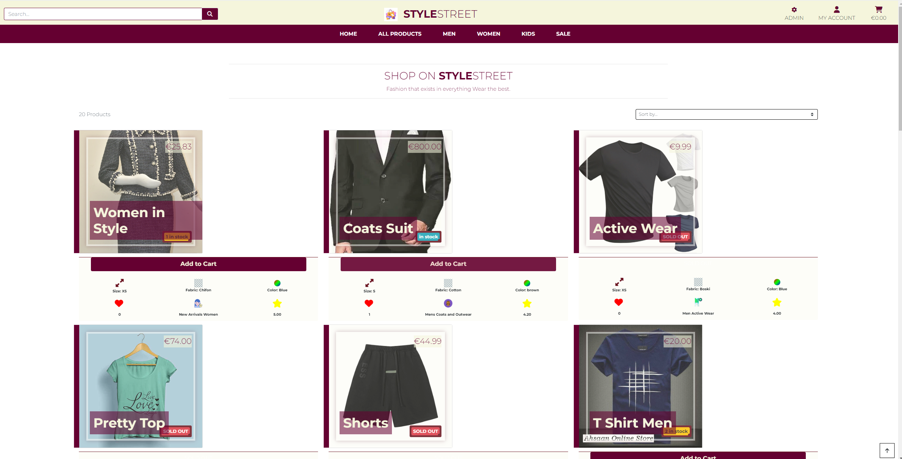
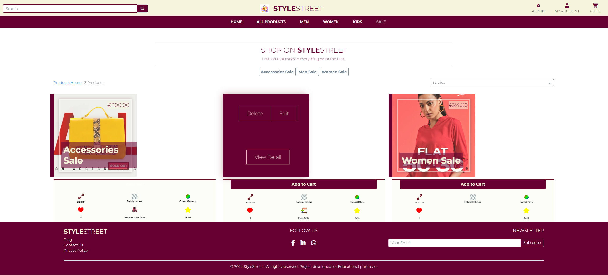

# Project Portfolio 5 - E-commerce Applications
## Welcome to Style Street - Your Premier E-commerce Destination

Discover a seamless shopping experience with Style Street, the cutting-edge e-commerce platform designed to elevate your retail experience. Our app combines state-of-the-art technology with intuitive design, ensuring a smooth and enjoyable journey from browsing to checkout.

## Project Goal

Our goal is to develop a user-friendly E-commerce platform using Django, providing customers with seamless browsing, secure transactions, and efficient order management. Through intuitive design and robust features, we aim to enhance the online shopping experience, driving customer satisfaction and facilitating business growth.

## Commit History

- I am aware my commit history isnt what it needs to be this is because I didnt realise My VS Code was not connected to Github. I was in coding my app and forgot to commit on time. 


**[View the live project here.](https://stylestreet-2f7b5324506f.herokuapp.com/)**

1. [Design & Planning](#design-&-planning)
    * [User Stories](#user-stories)
    * [Wireframes](#wireframes)
    * [Agile Methodology](#agile-methodology)
    * [Typography](#typography)
    * [Colour Scheme](#colour-scheme)
    * [Database Diagram](#database-diagram)
    
2. [Features](#features)
    * [Navigation](#Navigation-bar)
    * [Footer](#footer)
    * [Home page](#home-page)
    * [add your pages](#)
    * [Login page](#profile-page)
    * [Sign up page](#signup-page)

3. [Technologies Used](#technologies-used)
4. [Libraries](#libraries-used)
5. [Testing](#testing)
6. [Bugs](#bugs)
7. [Deployment](#deployment)
8. [Credits](#credits)
9. [Acknowledgment](#acknowledgment)

## Design & Planning:

### User Stories

# First-Time Visitor
- Learn About the Site: As a first-time visitor, I want to understand the site’s purpose to decide if it meets my needs.
- Browse Products: As a first-time visitor, I want to browse products to see what is available.
- Register for an Account: As a first-time visitor, I want to create an account to start shopping.
- Search for Products: As a first-time visitor, I want to search for specific products to find what I need quickly.
- View Product Details: As a first-time visitor, I want to view detailed product information to make informed purchase decisions.### Wireframes

# Returning Visitor
- Login to Account: As a returning visitor, I want to log in to my account to access my saved information and preferences.
- View Order History: As a returning visitor, I want to view my past orders to reorder items or check past purchases.
- Add to Cart: As a returning visitor, I want to add items to my shopping cart to purchase them.
- Save Payment Methods: As a returning visitor, I want to save and manage my payment methods for quicker checkouts in the future.
- Receive Personalized Recommendations: As a returning visitor, I want to receive product recommendations based on my previous purchases and preferences.
- Leave Reviews: As a returning visitor, I want to leave reviews and rate products I have purchased to share my experience with others.
- Subscribe to Newsletter: As a returning visitor, I want to subscribe to the newsletter to receive updates and promotions.
- Contact Customer Support: As a returning visitor, I want to contact customer support easily to get help with any issues.
- View New Arrivals: As a returning visitor, I want to view new product arrivals to stay updated with the latest items.

# Site Owner
- Manage Products: As a site owner, I want to add, update, or remove products to keep the inventory current.
- View Sales Reports: As a site owner, I want to view sales reports to understand the business performance.
- Manage Users: As a site owner, I want to manage user accounts to ensure a smooth user experience.
- Update Site Content: As a site owner, I want to update site content to keep information accurate and relevant.
- Handle Customer Inquiries: As a site owner, I want to handle customer inquiries to maintain customer satisfaction.
- Process Orders: As a site owner, I want to process and fulfill orders efficiently to ensure timely delivery.
- Manage Discounts and Promotions: As a site owner, I want to create and manage discounts and promotions to attract and retain customers.
- Monitor Site Performance: As a site owner, I want to monitor the site’s performance to ensure it runs smoothly and quickly.
- Manage Inventory Levels: As a site owner, I want to monitor and manage inventory levels to prevent stockouts and overstocking.
- Optimize SEO: As a site owner, I want to optimize the site for search engines to increase visibility and attract more visitors.
- Monitor Competitor Activities: As a site owner, I want to monitor competitor activities and trends to stay competitive in the market.
- Manage Refunds and Returns: As a site owner, I want to handle refunds and returns efficiently to maintain customer trust.

## Attach wireframes in this section

# Desktop Wireframes 


# Ipad Wireframes


# Mobile Wireframes


### Agile Methodology

# Epics & Admin/User Stories


7 Epics (milestones) were created which were then further developed

__[EPIC 1]  Django & Project Basic Setup__

 - As an ADMIN, I want to **setup Django app** so that I can start building my web store `MUST HAVE`  
 - As an ADMIN,  I want to **create 'home' app** so that I can start creating base templates `MUST HAVE`  
 - As an ADMIN, I want to be able to **configure and deploy to Heroku** so that my page is available for everyone to view `MUST HAVE`  
 - As a USER, I want to be able to **clearly see the site's purpose** is so that I can decide whether or not to continue browsing it `MUST HAVE`   


 __[EPIC 2]  User Authentication & Page Admin__

 - As an ADMIN, I want **setup AllAuth** so that I can manage users from the Admin Panel  `MUST HAVE`  
 - As an ADMIN, I will **make copies of allauth templates** so that I can adjust them to my user needs `MUST HAVE`  
 - As a USER, I want to be able to **register my account** so that I can view my profile `SHOULD HAVE`   
 - As a USER, I want to be able to **create a personalised user profile** so that I can re-use my details easily and view order history `SHOULD HAVE`   
 - As a USER, I want to be able to **login and logout** so that I can access my account info `SHOULD HAVE`   
 - As a USER, I want to be able to **get a confirmation email after registration** so that I can verify my account has been successfully registered `SHOULD HAVE`  
 - As an Admin I want to be able **let users sign in with SSO** so that *they can log in easily and securely**  `WONT HAVE` 


 __[EPIC 3]  Product App__

 - As an ADMIN/Product Owner, I want to be able to **add product** so that I add or increase stock  `MUST HAVE`  
 - As an ADMIN/Product Owner, I want to be able to **edit or update product** so that change product price, description etc.  `MUST HAVE`  
 - As an ADMIN/Product Owner, I want to be able to **delete product** so that I can remove it if it's not for sale `MUST HAVE`  
 - As a USER, I want to be able to **identify deals, clearance areas and special offers** so that ** I can take advantage of special offers** `MUST HAVE`  
 - As a USER, I want to be able to **view a list of products** so that I can browse and shop easily `MUST HAVE`  
 - As a USER, I want to be able to **see a detailed view of the product** so that I can read details of the product. `MUST HAVE`  
 - As a USER, I want to be able to **search the webpage** so that I can find specific products and check if it's in stock `SHOULD HAVE`  
 - As a USER, I want to be able to **view product by category** so that find product I'm looking for quickly and easily `MUST HAVE`  
 - As a USER, I want to be able to **sort available products** so that easily identify the best rated, best priced and by category products `MUST HAVE`  
 - As a USER, I want to be able to **view additional details** such as age group, play time and number of players so that I am fully aware of benefits of the product I want to buy `COULD HAVE`  
 - As a USER, I want to be able to **view a carousel of images** on the home page so that I feel engaged and enticed straight away `COULD HAVE`  
 - As a User, I want to be able to **like product** so that I can easily **view my liked products** `COULD HAVE`  
 - As a User, I want the have the ability **to like product count** so that I can **clearly see how many people like the same product** `COULD HAVE`  


 __[EPIC 4]  Bag, Checkout and Payment__

 - As a USER, I want to be able to **add products to a bag** so that I can purchase products i want `MUST HAVE`   
 - As a USER, I want to be able to **view the total of my purchas**e so that I'm in full control of what I am buying `MUST HAVE`   
 - As a USER, I want to be able to **add/remove product quantity** so that I am in full control of how many items I am buying `MUST HAVE`   
 - As a USER, I want to be able to **view my bag** so that view product info, quantity and price of my purchase `MUST HAVE`   
 - As a USER, I want to be able to **enter payment info** so that I can check out easily `MUST HAVE`   
 - As a USER, I want to feel that my **payment is safe and secure** so that I feel confident to provide my card details `MUST HAVE`   
 - As a USER, I want to get **an email confirmation after my purchase** so that I keep a record of what I've purchased `MUST HAVE`   
 - As a USER, I want to be able to type in a **discount code** so that I can avail of a shop promo `WONT HAVE`  


 __[EPIC 5]  Subscriptions__   

 - As a USER,  I want to be able to **subscribe to a newsletter** so that I'm being kept up to date with all things new at GamerOnBoard `SHOULD HAVE`  


 __[EPIC 6] Reviews and Blog__   

 - As a site user, I want to be able to view blog posts on the website so that I can read any posts/comments `COULD HAVE`   
 - As a User, I want to be able to create blog posts from the front end so that I can share information with site visitors `COULD HAVE`   
 - As a User, I want to be able to edit existing blog posts so that I can ensure that posts are up to date  `COULD HAVE`   
 - As a User, I want to be able to delete existing blog posts so that I can remove any unwanted posts from the site `COULD HAVE`   


 __[EPIC 7]  Marketing and Search Engine Optimalisation__

 - As an ADMIN, I want to be able to - Marketing `MUST HAVE`   
 - As an ADMIN, I want to be able to - Social Media `MUST HAVE`   
 - As an ADMIN, I want to be able to - Social Media Extra `SHOULD HAVE` 

 ### MoSCoW Prioritization

This project was developed using agile methodologies by delivering small features (User Stories) across the project.

The Kanban board was created using Github projects and can be located [here](https://github.com/AbdulSyed05/style-street/projects?query=is%3Aopen) and can be viewed to see more information on the project cards. 

Using this approach, I was able to apply the MoSCow prioritization and label user stories.
User Stories were assigned to Epics, prioritized under the labels:

- `MUST HAVE` - guaranteed to be delivered (*max 60% of stories*)
- `SHOULD HAVE` - adds significant value, but not vital (*the rest ~20% of stories*)
- `COULD HAVE` - has small impact if left out (*20% of stories*)
- `WON'T HAVE` - not a priority for this iteration

To ensure that all core requirements were completed I worked on the 'MUST HAVE' epics/user stories first.


### Typography
 
 - Montserrat has been used as a main font

 root {
    --main-font: 'Montserrat', sans-serif;
}

### Colour Scheme


Image of the database diagram for your project, you can name your database models as well and how they are connected

## Features:

# Home Page 


# Login Page


# All Products Page


# Sales Page


# Product Management


# User Profile Page


# Checkout Page


# Shopping Cart


# Payment Processing


# Thank you for your purchase page


## Future Features 
- Personalized Recommendations: Implement a recommendation engine that analyzes user behavior and preferences to suggest relevant products, increasing engagement and sales.

- Social Media Integration: Allow users to share their favorite products on social media platforms and integrate social login options to streamline the registration process.

- Multi-Language Support: Expand your target audience by adding support for multiple languages, enabling users from different regions to access and navigate the site in their preferred language.

- Customer Reviews and Ratings: Enable customers to leave reviews and ratings for products, fostering trust and credibility among potential buyers and helping them make informed purchasing decisions.

- Subscription Services: Introduce subscription-based services or product bundles, providing customers with recurring deliveries and discounts, promoting customer loyalty and repeat purchases.

## Testing
Important part of your README!!!

### Google's Lighthouse Performance


### Browser Compatibility
|  Browser | Links  | Pages  | Responsivnes  | Form fields  |
| ------------ | ------------ | ------------ | ------------ | ------------ |
| Mozila  | Works as expected| Loading pages no issue  |  Responsivness works as expected |  Works as expected |
|  Chrome | Works as expected  |  Loading pages no issue | Responsivness works as expected  | Works as expected  |
|  Edge |  Works as expected | Loading pages no issue  | Responsivness works as expected  |  Works as expected |

### Responsiveness


### Code Validation

# HTML Code Validation

# Home


# Login Validation


# Logout Validation


# Product Validation


# Signup Validation


# Update Profile Validation


# Css Code Validation
1[Screenshot](media/base.cssvalidation.png)

### Manual Testing user stories
Test all your user stories, you an create table 
User Story |  Test | Pass
--- | --- | :---:
paste here you user story | what is visible to the user and what action they should perform | &check;
- attach screenshot
### Manual Testing features
Test all your features, you can use the same approach 
| Status | feature
|:-------:|:--------|
| &check; | description
- attach screenshot

## Bugs

### User Authentication Bugs

1. **Users cannot log in even with correct credentials**
   - **Description:** Users might face login issues due to incorrect authentication backend configuration or database connection problems.
   - **Resolution:** Check `settings.py` for correct authentication backend settings and ensure the database is properly connected.

2. **Password reset emails are not being sent**
   - **Description:** This issue might be due to misconfigured email backend or missing email templates.
   - **Resolution:** Verify email backend settings in `settings.py` and ensure email server credentials are correct. Check for the existence of email templates.

### Product Management Bugs

1. **New products are not appearing in the product listing**
   - **Description:** Caching issues or problems with database queries can prevent new products from appearing.
   - **Resolution:** Clear the cache if enabled and check the views and queries fetching the product list.

2. **Product images are not displaying**
   - **Description:** Incorrect media file handling or misconfigured URLs can cause this issue.
   - **Resolution:** Ensure media root and URL settings in `settings.py` are correct and images are uploaded properly.

### Cart Functionality Bugs

1. **Items are not being added to the cart**
   - **Description:** Issues with session management or cart view logic can prevent items from being added.
   - **Resolution:** Check session settings in `settings.py` and debug the cart views.

2. **Cart total is incorrect**
   - **Description:** Rounding errors or incorrect price calculations can lead to an incorrect cart total.
   - **Resolution:** Verify the logic for calculating the cart total and check for rounding issues.

### Checkout Process Bugs

1. **Checkout process fails at the payment step**
   - **Description:** Incorrect payment gateway integration or network issues can cause the checkout process to fail.
   - **Resolution:** Check payment gateway configuration and ensure network connectivity. Handle exceptions properly.

2. **Orders are not being recorded in the database**
   - **Description:** Problems in the order creation logic or database connectivity issues can prevent orders from being recorded.
   - **Resolution:** Debug order creation views and models, and check database connection.


### Technologies Used

- [HTML5](https://html.spec.whatwg.org/) used for page content and structure 
- [CSS](https://www.w3.org/Style/CSS/Overview.en.html) used for page styling
- [Javascript](https://www.javascript.com/) used for dynamically updated content
- [Python](https://www.python.org/) - used for the functionality of the program

### Frameworks & Tools

- [Django](https://www.djangoproject.com/) used as main python framework
- [Stripe Payments](https://stripe.com/) Payments infrastructure for the Internet
- [Bootstrap](https://blog.getbootstrap.com/) used for page layout and spacing
- [PostgreSQL](https://www.postgresql.org) used for database management
- [ElephantSQL](https://www.elephantsql.com/) used for production database
- [Heroku](https://dashboard.heroku.com/apps) used to deploy application
- [AWS](https://aws.amazon.com/s3/) used for online static file storage
- [Gitpod](https://www.gitpod.io/) used to create and host the website
- [Github](https://github.com/) used to deploy the website 
- [Balsamiq](https://balsamiq.com/) used to create page wireframes
- [Stackoverflow](https://stackoverflow.com/) used to troubleshoot code issues
- [CI Python Linter](https://pep8ci.herokuapp.com/) used as Python code validator
- [Chrome Dev Tools](https://developer.chrome.com/docs/devtools/)
- [Grammarly](https://www.grammarly.com/) used to check typography
- [Am I Responsive](https://amiresponsive.co.uk/) mockup image of the home page on various devices 
- [ChatGPT](chat.openai.com) - Helpful Tool

### Imported Libraries and Packages

- [gunicorn]() - Python WSGI HTTP Server for UNIX
- [psycopg2]() - PostgreSQL database adapter for Python
- [dj-database-url]() - Django utility to utilise the DATABASE_URL environment variable to configure the Django application. Used with PostgreSQL
- [Django]() - Python package for the Django framework
- [django-allauth]() - Django user authentication, registration and account management
- [django-crispy-forms]() - Django package that provides tags and filters to control the rendering behaviour of Django forms
- [django-countries] - A Django application that provides country choices for use with forms
- [django-storages] - provides a variety of storage backends in a single library
- [sqlparse] - is a non-validating SQL parser for Python. It provides support for parsing, splitting and formatting SQL statements
- [stripe] - Stripe Payments webhook
- [boto3] -  to create, configure, and manage AWS services
- [s3transfer] - a Python library for managing Amazon S3 transfers
- [botocore] - A low-level interface to a growing number of Amazon Web Services
- [jmespath] - allows you to declaratively specify how to extract elements from a JSON document.
- [oauthlib] - is a framework which implements the logic of OAuth1 or OAuth2 without assuming a specific HTTP request object or web framework
- [asgiref] -  Provides an optional template to start ASGI channel layers from with the two exceptions you need provided and all APIs
- [Pillow] -  adds image processing capabilities to your Python interpreter
- [PyJWT] - A library which allows you to encode and decode JSON Web Tokens 
- [pytz] - This library allows accurate and cross platform timezone calculations using Python

## Deployment
The live deployed application can be found deployed on [Heroku](https://stylestreet-2f7b5324506f.herokuapp.com/).

#### Creating Repository on GitHub
- First make sure you are signed into [Github](https://github.com/) and go to the code institutes template, which can be found [here](https://github.com/Code-Institute-Org/gitpod-full-template).
- Then click on **use this template** and select **Create a new repository** from the drop-down. Enter the name for the repository and click **Create repository from template**.
- Once the repository was created, I clicked the green **gitpod** button to create a workspace in gitpod so that I could write the code for the site.

#### Creating an app on Heroku
- After creating the repository on GitHub, head over to [heroku](https://www.heroku.com/) and sign in.
- On the home page, click **New** and **Create new app** from the drop down.
- Give the app a name(this must be unique) and select a **region** I chose **Europe** as I am in Europe, Then click **Create app**.

#### Create a database On ElephantSQL
- Log into the [ElephantSQL](https://www.elephantsql.com/) website and click **Create new Instance**
- Enter a **Name** and keep the plan as **Tiny Turtle Free**, then **tags** field can be left blank, Select a region closest to you, I selected **EU-West-1(Ireland)** as I'm in Ireland. Then click **Review** and afterward click **create an instance**.
- On The Dashboard click on your database instance name.
- You will see the details for your database instance, in the URL section click on the copy icon to copy the database URL.
- Head over to gitpod and create a **Database URL** environment variable in your env.py file and set it equal to the copied URL.

### Amazon AWS

This project uses [AWS](https://aws.amazon.com) to store media and static files online, due to the fact that Heroku doesn't persist this type of data.

Once you've created an AWS account and logged-in, follow these series of steps to get your project connected.
Make sure you're on the **AWS Management Console** page.

#### S3 Bucket

- Search for **S3**.
- Create a new bucket, give it a name (matching your Heroku app name), and choose the region closest to you.
- Uncheck **Block all public access**, and acknowledge that the bucket will be public (required for it to work on Heroku).
- From **Object Ownership**, make sure to have **ACLs enabled**, and **Bucket owner preferred** selected.
- From the **Properties** tab, turn on static website hosting, and type `index.html` and `error.html` in their respective fields, then click **Save**.
- From the **Permissions** tab, paste in the following CORS configuration:

	```shell
	[
		{
			"AllowedHeaders": [
				"Authorization"
			],
			"AllowedMethods": [
				"GET"
			],
			"AllowedOrigins": [
				"*"
			],
			"ExposeHeaders": []
		}
	]
	```

- Copy your **ARN** string.
- From the **Bucket Policy** tab, select the **Policy Generator** link, and use the following steps:
	- Policy Type: **S3 Bucket Policy**
	- Effect: **Allow**
	- Principal: `*`
	- Actions: **GetObject**
	- Amazon Resource Name (ARN): **paste-your-ARN-here**
	- Click **Add Statement**
	- Click **Generate Policy**
	- Copy the entire Policy, and paste it into the **Bucket Policy Editor**

		```shell
		{
			"Id": "Policy1234567890",
			"Version": "2012-10-17",
			"Statement": [
				{
					"Sid": "Stmt1234567890",
					"Action": [
						"s3:GetObject"
					],
					"Effect": "Allow",
					"Resource": "arn:aws:s3:::your-bucket-name/*"
					"Principal": "*",
				}
			]
		}
		```

	- Before you click "Save", add `/*` to the end of the Resource key in the Bucket Policy Editor (like above).
	- Click **Save**.
- From the **Access Control List (ACL)** section, click "Edit" and enable **List** for **Everyone (public access)**, and accept the warning box.
	- If the edit button is disabled, you need to change the **Object Ownership** section above to **ACLs enabled** (mentioned above).

#### IAM

Back on the AWS Services Menu, search for and open **IAM** (Identity and Access Management).
Once on the IAM page, follow these steps:

- From **User Groups**, click **Create New Group**.
	- Suggested Name: `gamer-on-board` (group + the project name)
- Tags are optional, but you must click it to get to the **review policy** page.
- From **User Groups**, select your newly created group, and go to the **Permissions** tab.
- Open the **Add Permissions** dropdown, and click **Attach Policies**.
- Select the policy, then click **Add Permissions** at the bottom when finished.
- From the **JSON** tab, select the **Import Managed Policy** link.
	- Search for **S3**, select the `AmazonS3FullAccess` policy, and then **Import**.
	- You'll need your ARN from the S3 Bucket copied again, which is pasted into "Resources" key on the Policy.

		```shell
		{
			"Version": "2012-10-17",
			"Statement": [
				{
					"Effect": "Allow",
					"Action": "s3:*",
					"Resource": [
						"arn:aws:s3:::gamer-on-board",
						"arn:aws:s3:::gamer-on-board/*"
					]
				}
			]
		}
		```
	
	- Click **Review Policy**.
	- Suggested Name: `gamer-on-board` (policy + the project name)
	- Provide a description:
		- "Access to S3 Bucket for gamer-on-board static files."
	- Click **Create Policy**.
- From **User Groups**, click your "gamer-on-board".
- Click **Attach Policy**.
- Search for the policy you've just created ("gamer-on-board") and select it, then **Attach Policy**.
- From **User Groups**, click **Add User**.
	- Suggested Name: `gamer-on-board` (user + the project name)
- For "Select AWS Access Type", select **Programmatic Access**.
- Select the group to add your new user to: `gamer-on-board`
- Tags are optional, but you must click it to get to the **review user** page.
- Click **Create User** once done.
- You should see a button to **Download .csv**, so click it to save a copy on your system.
	- **IMPORTANT**: once you pass this page, you cannot come back to download it again, so do it immediately!
	- This contains the user's **Access key ID** and **Secret access key**.
	- `AWS_ACCESS_KEY_ID` = **Access key ID**
	- `AWS_SECRET_ACCESS_KEY` = **Secret access key**

#### Final AWS Setup

- If Heroku Config Vars has `DISABLE_COLLECTSTATIC` still, this can be removed now, so that AWS will handle the static files.
- Back within **S3**, create a new folder called: `media`.
- Select any existing media images for your project to prepare them for being uploaded into the new folder.
- Under **Manage Public Permissions**, select **Grant public read access to this object(s)**.
- No further settings are required, so click **Upload**.

### Stripe API

This project uses [Stripe](https://stripe.com) to handle the ecommerce payments.

Once you've created a Stripe account and logged-in, follow these series of steps to get your project connected.

- From your Stripe dashboard, click to expand the "Get your test API keys".
- You'll have two keys here:
	- `STRIPE_PUBLIC_KEY` = Publishable Key (starts with **pk**)
	- `STRIPE_SECRET_KEY` = Secret Key (starts with **sk**)

As a backup, in case users prematurely close the purchase-order page during payment, we can include Stripe Webhooks.

- From your Stripe dashboard, click **Developers**, and select **Webhooks**.
- From there, click **Add Endpoint**.
	- `https://stylestreet-2f7b5324506f.herokuapp.com/checkout/`
- Click **receive all events**.
- Click **Add Endpoint** to complete the process.
- You'll have a new key here:
	- `STRIPE_WH_SECRET` = Signing Secret (Wehbook) Key (starts with **wh**)

#### Deploying to Heroku.
[Setting up basic Django Project and Deploying to Heroku CI Doc](https://docs.google.com/document/d/1P5CWvS5cYalkQOLeQiijpSViDPogtKM7ZGyqK-yehhQ/edit)

This project uses [Heroku](https://www.heroku.com), a platform as a service (PaaS) that enables developers to build, run, and operate applications entirely in the cloud.

Deployment steps are as follows, after account setup:

1. Select *New* in the top-right corner of your Heroku Dashboard, and select *Create new app* from the dropdown menu.
1. Your app name must be unique, and then choose a region closest to you (EU or USA), and finally, select *Create App*.
1. Further down, to support dependencies, select *Add Buildpack*.
1. The order of the buildpacks is important, select `Python` first, then `Node.js` second. (if they are not in this order, you can drag them to rearrange them)
1. From the new app *Settings*, click *Reveal Config Vars*, and set your environment variables.

    
    -  Key Value
    -  `AWS_ACCESS_KEY_ID`
    -  `AWS_SECRET_ACCESS_KEY`
    -  `DATABASE_URL`
    -  `DISABLE_COLLECTSTATIC`
    -  `EMAIL_HOST_PASS`
    -  `EMAIL_HOST_USER`
    -  `SECRET_KEY`
    -  `STRIPE_PUBLIC_KEY`
    -  `STRIPE_SECRET_KEY`
    -  `STRIPE_WH_SECRET`
    -  `USE_AWS`

Heroku needs two additional files in order to deploy properly.
- requirements.txt
- Procfile

You can install this project's *requirements* (where applicable) using:
- `pip3 install -r requirements.txt`

If you have your own packages that have been installed, then the requirements file needs updated using:
- `pip3 freeze --local > requirements.txt`

The *Procfile* can be created with the following command:
- `echo web: gunicorn app_name.wsgi > Procfile`
- *replace *app_name* with the name of your primary Django app name; the folder where settings.py is located*

For Heroku deployment, follow these steps to connect your own GitHub repository to the newly created app:

Either:
- Select *Automatic Deployment* from the Heroku app.

Or:
- In the Terminal/CLI, connect to Heroku using this command: `heroku login -i`
- Set the remote for Heroku: `heroku git:remote -a <app_name>` (replace app_name with your app, without the angle-brackets)
- After performing the standard Git `add`, `commit`, and `push` to GitHub, you can now type:
	- `git push heroku main`

The project should now be connected and deployed to Heroku!

### Local Deployment

This project can be cloned or forked in order to make a local copy on your own system.

For either method, you will need to install any applicable packages found within the *requirements.txt* file.
- `pip3 install -r requirements.txt`.

You will need to create a new file called `env.py` at the root-level,
and include the same environment variables listed above from the Heroku deployment steps.

Sample `env.py` file:

```python
import os

os.environ.setdefault("AWS_ACCESS_KEY_ID", `HEROKU CONFIG VARS`)
os.environ.setdefault("AWS_SECRET_ACCESS_KEY", `HEROKU CONFIG VARS`)
os.environ.setdefault("DATABASE_URL", `HEROKU CONFIG VARS`)
os.environ.setdefault("EMAIL_HOST_PASS", `HEROKU CONFIG VARS`)
os.environ.setdefault("EMAIL_HOST_USER", `HEROKU CONFIG VARS`)
os.environ.setdefault("SECRET_KEY", `HEROKU CONFIG VARS`)
os.environ.setdefault("STRIPE_PUBLIC_KEY", `HEROKU CONFIG VARS`)
os.environ.setdefault("STRIPE_SECRET_KEY", `HEROKU CONFIG VARS`)
os.environ.setdefault("STRIPE_WH_SECRET", `HEROKU CONFIG VARS`)

# local environment only (do not include these in production/deployment!)
os.environ.setdefault("DEBUG", "True")
```

Once the project is cloned or forked, in order to run it locally, you'll need to follow these steps:
- Start the Django app: `python3 manage.py runserver`
- Stop the app once it's loaded: `CTRL+C` or `⌘+C` (Mac)
- Make any necessary migrations: `python3 manage.py makemigrations`
- Migrate the data to the database: `python3 manage.py migrate`
- Create a superuser: `python3 manage.py createsuperuser`
- Load fixtures (if applicable): `python3 manage.py loaddata file-name.json` (repeat for each file)
- Everything should be ready now, so run the Django app again: `python3 manage.py runserver`

## Credits

- [Stack Overflow](https://stackoverflow.com/) is probably a developer's best resource, this provided me with many answers to my questions.

- [W3schools](https://www.w3schools.com/) this was great for looking up forgotten **CSS** syntax and how to use it.

- [CodeInstitute](https://learn.codeinstitute.net/) for their walkthrough project, which guided me with website build especially for stripe payment, custom model.

- [youtube](https://www.youtube.com/channel/UCCezIgC97PvUuR4_gbFUs5g) Corey Schafer 
 videos from **codemy**,  **djangolessons**

- [Allauth](https://django-allauth.readthedocs.io/en/latest/) for their documentation which was helpfull in creating user authentication.

- [Djangoforbeginners](https://djangoforbeginners.com/) for providing useful information abut basic concepts and setup for django.

- [DjangoDocumentation](https://docs.djangoproject.com/en/5.0/) Django Documentation used for this project.

- [Bootstrap](https://getbootstrap.com/) Used Bootstrap.

#### Cloning

You can clone the repository by following these steps:

1. Go to the [GitHub repository](https://stylestreet-2f7b5324506f.herokuapp.com/) 
2. Locate the Code button above the list of files and click it 
3. Select if you prefer to clone using HTTPS, SSH, or GitHub CLI and click the copy button to copy the URL to your clipboard
4. Open Git Bash or Terminal
5. Change the current working directory to the one where you want the cloned directory
6. In your IDE Terminal, type the following command to clone my repository:
	- `git clone https://stylestreet-2f7b5324506f.herokuapp.com/`
7. Press Enter to create your local clone.

Alternatively, if using Gitpod, you can click below to create your own workspace using this repository.

[](https://abdulsyed05-stylestreet-u3fvmjzsira.ws-eu114.gitpod.io//)

#### Forking

By forking the GitHub Repository, we make a copy of the original repository on our GitHub account to view and/or make changes without affecting the original owner's repository.
You can fork this repository by using the following steps:

1. Log in to GitHub and locate the [GitHub Repository](https://stylestreet-2f7b5324506f.herokuapp.com/)
2. At the top of the Repository (not top of page) just above the "Settings" Button on the menu, locate the "Fork" Button.
3. Once clicked, you should now have a copy of the original repository in your own GitHub account!

## Acknowledgment
- I would like to thank Juliaa Konovalova for being my guiding light in the world of Django. Your expertise and encouragement have made this coding journey an incredible experience. I am sincerely grateful for your mentorship .

- I would like to thank Code Institutes Slack Community, and tutor support (Especially Joanne) as this helped me so much when I got stuck on part of my project.

- I would also like to thank our cohort facilitator Marko Tot, for answering any course-related questions I asked and for providing us with weekly guidance information about the project