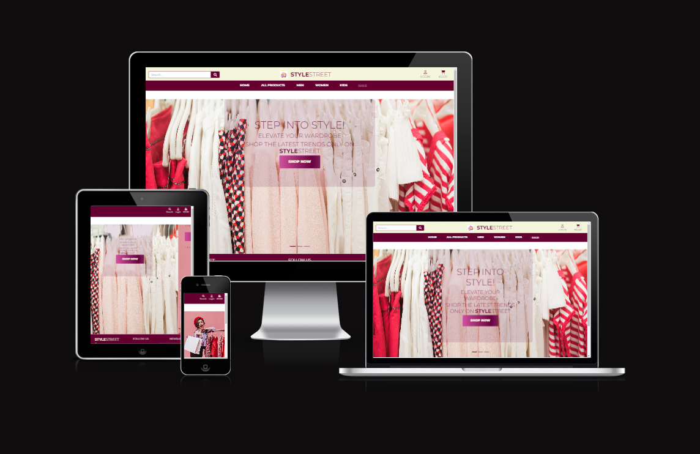

# Project-Portfolio-5-Ecommerce
## Welcome to Style Street - Your Premier E-commerce Destination

Discover a seamless shopping experience with Style Street, the cutting-edge e-commerce platform designed to elevate your retail experience. Our app combines state-of-the-art technology with intuitive design, ensuring a smooth and enjoyable journey from browsing to checkout.

## Project Goal

Our goal is to develop a user-friendly E-commerce platform using Django, providing customers with seamless browsing, secure transactions, and efficient order management. Through intuitive design and robust features, we aim to enhance the online shopping experience, driving customer satisfaction and facilitating business growth.

**[View the live project here.](https://stylestreet-2f7b5324506f.herokuapp.com/)**

1. [Design & Planning](#design-&-planning)
    * [User Stories](#user-stories)
    * [Wireframes](#wireframes)
    * [Agile Methodology](#agile-methodology)
    * [Typography](#typography)
    * [Colour Scheme](#colour-scheme)
    * [Database Diagram](#database-diagram)
    
2. [Features](#features)
    * [Navigation](#Navigation-bar)
    * [Footer](#footer)
    * [Home page](#home-page)
    * [add your pages](#)
    * [Login page](#profile-page)
    * [Sign up page](#signup-page)

3. [Technologies Used](#technologies-used)
4. [Libraries](#libraries-used)
5. [Testing](#testing)
6. [Bugs](#bugs)
7. [Deployment](#deployment)
8. [Credits](#credits)
9. [Acknowledgment](#acknowledgment)

## Design & Planning:

### User Stories

# First-Time Visitor
- Learn About the Site: As a first-time visitor, I want to understand the site’s purpose to decide if it meets my needs.
- Browse Products: As a first-time visitor, I want to browse products to see what is available.
- Register for an Account: As a first-time visitor, I want to create an account to start shopping.
- Search for Products: As a first-time visitor, I want to search for specific products to find what I need quickly.
- View Product Details: As a first-time visitor, I want to view detailed product information to make informed purchase decisions.### Wireframes

# Returning Visitor
- Login to Account: As a returning visitor, I want to log in to my account to access my saved information and preferences.
- View Order History: As a returning visitor, I want to view my past orders to reorder items or check past purchases.
- Add to Cart: As a returning visitor, I want to add items to my shopping cart to purchase them.
- Save Payment Methods: As a returning visitor, I want to save and manage my payment methods for quicker checkouts in the future.
- Receive Personalized Recommendations: As a returning visitor, I want to receive product recommendations based on my previous purchases and preferences.
- Leave Reviews: As a returning visitor, I want to leave reviews and rate products I have purchased to share my experience with others.
- Subscribe to Newsletter: As a returning visitor, I want to subscribe to the newsletter to receive updates and promotions.
- Contact Customer Support: As a returning visitor, I want to contact customer support easily to get help with any issues.
- View New Arrivals: As a returning visitor, I want to view new product arrivals to stay updated with the latest items.

# Site Owner
- Manage Products: As a site owner, I want to add, update, or remove products to keep the inventory current.
- View Sales Reports: As a site owner, I want to view sales reports to understand the business performance.
- Manage Users: As a site owner, I want to manage user accounts to ensure a smooth user experience.
- Update Site Content: As a site owner, I want to update site content to keep information accurate and relevant.
- Handle Customer Inquiries: As a site owner, I want to handle customer inquiries to maintain customer satisfaction.
- Process Orders: As a site owner, I want to process and fulfill orders efficiently to ensure timely delivery.
- Manage Discounts and Promotions: As a site owner, I want to create and manage discounts and promotions to attract and retain customers.
- Monitor Site Performance: As a site owner, I want to monitor the site’s performance to ensure it runs smoothly and quickly.
- Manage Inventory Levels: As a site owner, I want to monitor and manage inventory levels to prevent stockouts and overstocking.
- Optimize SEO: As a site owner, I want to optimize the site for search engines to increase visibility and attract more visitors.
- Monitor Competitor Activities: As a site owner, I want to monitor competitor activities and trends to stay competitive in the market.
- Manage Refunds and Returns: As a site owner, I want to handle refunds and returns efficiently to maintain customer trust.

Attach wireframes in this section
### Agile Methodology
Explain agile approach to your project (itterations, user stories, tasks,acceptance criteria, labels, story points...) and insert screenshoots of your Kanban board 
### Typography
Explain font you've used for your project
### Colour Scheme
Screenshoot of the colour scheme for your project
### DataBase Diagram
Image of the database diagram for your project, you can name your database models as well and how they are connected

## Features:
Explain your features on the website,(navigation, pages, links, forms, input fields, CRUD....)
## Technologies Used
List of technologies used for your project
## Testing
Important part of your README!!!
### Google's Lighthouse Performance
Screenshots of certain pages and scores (mobile and desktop)
### Browser Compatibility
Check compatability with different browsers (Firefox, Edge, Chrome)
### Responsiveness
Screenshots of the responsivness, pick few devices
### Code Validation
Validate your code HTML, CSS, JS & Python (Validate all your templates, static files, views, forms, models, urls), display screenshots
### Manual Testing user stories
Test all your user stories, you an create table 
User Story |  Test | Pass
--- | --- | :---:
paste here you user story | what is visible to the user and what action they should perform | &check;
- attach screenshot
### Manual Testing features
Test all your features, you can use the same approach 
| Status | feature
|:-------:|:--------|
| &check; | description
- attach screenshot
### Automated testing
If you created automated tests, insert screenshoots of your coverage and number of tests
## Bugs
List of bugs and how did you fix them, you can create simple table
| Bug | Fix
|:-------:|:--------|
|   |    |
## Deployment
This website is deployed to Heroku from a GitHub repository, the following steps were taken:

#### Creating Repository on GitHub
- First make sure you are signed into [Github](https://github.com/) and go to the code institutes template, which can be found [here](https://github.com/Code-Institute-Org/gitpod-full-template).
- Then click on **use this template** and select **Create a new repository** from the drop-down. Enter the name for the repository and click **Create repository from template**.
- Once the repository was created, I clicked the green **gitpod** button to create a workspace in gitpod so that I could write the code for the site.

#### Creating an app on Heroku
- After creating the repository on GitHub, head over to [heroku](https://www.heroku.com/) and sign in.
- On the home page, click **New** and **Create new app** from the drop down.
- Give the app a name(this must be unique) and select a **region** I chose **Europe** as I am in Europe, Then click **Create app**.

#### Create a database On ElephantSQL
- Log into the [ElephantSQL](https://www.elephantsql.com/) website and click **Create new Instance**
- Enter a **Name** and keep the plan as **Tiny Turtle Free**, then **tags** field can be left blank, Select a region closest to you, I selected **EU-West-1(Ireland)** as I'm in Ireland. Then click **Review** and afterward click **create an instance**.
- On The Dashboard click on your database instance name.
- You will see the details for your database instance, in the URL section click on the copy icon to copy the database URL.
- Head over to gitpod and create a **Database URL** environment variable in your env.py file and set it equal to the copied URL.

#### Deploying to Heroku.
- Head back over to [heroku](https://www.heroku.com/) and click on your **app** and then go to the **Settings tab**
- On the **settings page** scroll down to the **config vars** section and enter the **DATABASE_URL** which you will set equal to the elephantSQL URL, create **Secret key** this can be anything,
**CLOUDINARY_URL** this will be set to your cloudinary url and finally **Port** which will be set to 8000.
- Then scroll to the top and go to the **deploy tab** and go down to the **Deployment method** section and select **Github** and then sign into your account.
- Below that in the **search for a repository to connect to** search box enter the name of your repository that you created on **GitHub** and click **connect**
- Once it has been connected scroll down to the **Manual Deploy** and click **Deploy branch** when it has deployed you will see a **view app** button below and this will bring you to your newly deployed app.
- Please note that when deploying manually you will have to deploy after each change you make to your repository.
## Credits
List of used resources for your website (text, images, snippets of code, projects....)
## Acknowledgment
Mention people who helped you with your project(mentor, colleagues...)